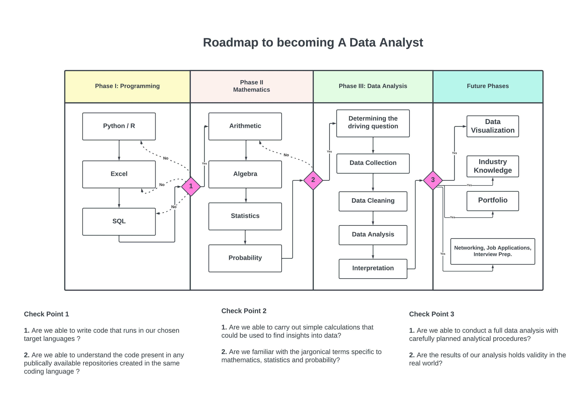

Becoming a Data Analyst like any other speciality requires a thorough research of topics and subjects and a step by step preparation. It is a combination of both mathematical and analytical expertise.

Although not every subject need to be expertised, it certainly helps to be familiar with most of the technical aspect of each one of them. 

Therefore, to help anyone who is aspiring to be a Data Analyst in future, I have created a Roadmap to  simplify their research on this specialization.

